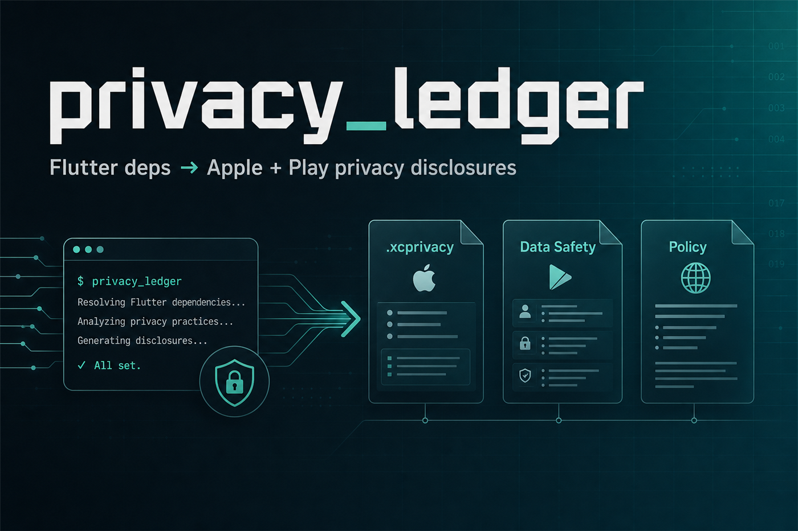
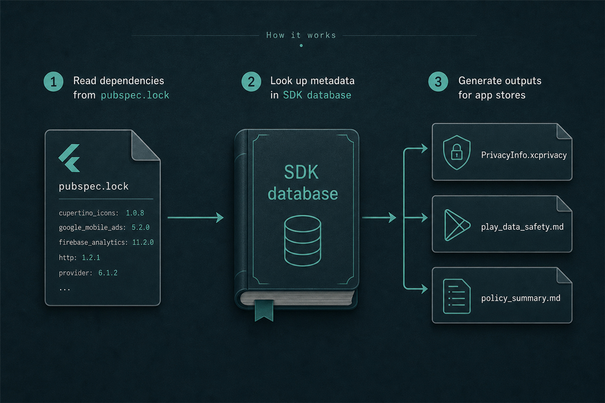
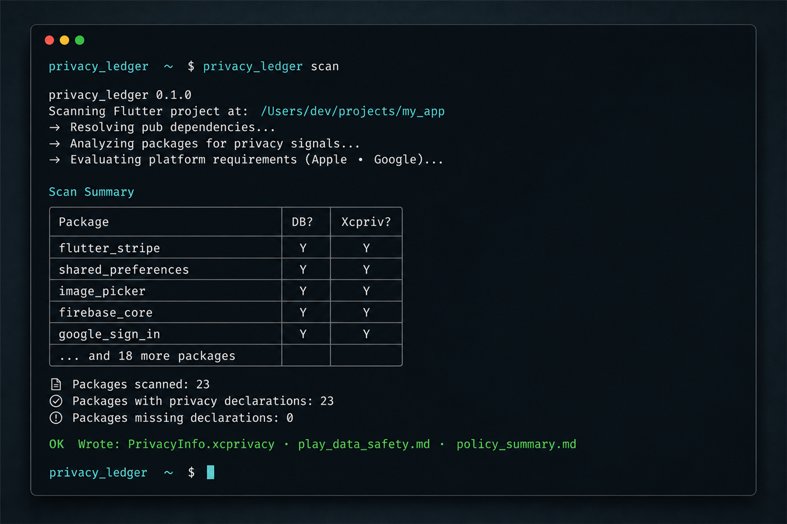

# privacy_ledger

<p align="center">
  
</p>

Dart CLI that scans a Flutter project's dependency tree and generates privacy
disclosure artifacts for Apple and Google Play from a curated SDK
data-collection database.

## The problem

Every app release needs two manually filled privacy disclosures:

- **Apple:** `PrivacyInfo.xcprivacy` (data types + Required Reason API usage)
- **Google Play:** the Data Safety form (types, purposes, sharing, encryption, deletion)

Both depend on every SDK the app pulls in — AdMob, RevenueCat, Firebase,
analytics, crash reporters — not just your own code. Flutter plugins rarely
ship complete manifests, so you research the same dependencies again each
release. Mistakes matter: Google cross-checks Data Safety answers against
real behavior.

Existing tools are mostly manual form fillers or generic privacy-policy
generators. Nothing scans your actual `pubspec.lock` and maps known SDKs to
**both** stores' forms from one source of truth.

## How it works

<p align="center">
  
</p>

1. Scan `pubspec.yaml` + `pubspec.lock`
2. Match packages against the bundled SDK data-collection database (plus optional overrides)
3. Emit three artifacts into `--output`

## Installation

```bash
dart pub global activate privacy_ledger
```

Ensure the pub global bin directory is on your `PATH` (see
[Running a script from your PATH](https://dart.dev/tools/pub/cmd/pub-global#running-a-script-from-your-path)).

From a local checkout:

```bash
dart pub global activate --source path .
```

## Usage

```bash
privacy_ledger scan --project /path/to/flutter/app --output ./privacy_out
```

Flags:

| Flag | Description |
|------|-------------|
| `--project` / `-p` | Flutter/Dart project root (must contain `pubspec.yaml` + `pubspec.lock`) |
| `--output` / `-o` | Directory for generated files |
| `--dry-run` | Print the dependency summary only; write nothing |

Run `dart pub get` / `flutter pub get` in the target project first if
`pubspec.lock` is missing.

### Example CLI output

<p align="center">
  
</p>

### Outputs

All written into `--output`:

1. `PrivacyInfo.xcprivacy` — Apple privacy manifest plist
2. `play_data_safety.md` — Play Console Data Safety checklist
3. `policy_summary.md` — plain-English draft for a hosted privacy policy

Console output lists matched packages, whether each is in the database, and
whether it requires an xcprivacy entry. Unknown **direct** packages are warned
loudly.

## Overrides file

Create `privacy_ledger.overrides.yaml` in the scanned project root to add
unknown packages or replace bundled entries (overrides win entirely):

```yaml
packages:
  - package: my_custom_sdk
    display_name: My Custom SDK
    data_collected:
      - type: device_id
        purpose: analytics
        shared_with_third_parties: false
        optional: false
        linked_to_identity: true
    encrypted_in_transit: true
    user_can_request_deletion: true
    requires_xcprivacy_entry: false
    required_reason_apis: []
    notes: "Project-specific entry"

  - package: google_mobile_ads
    display_name: Google AdMob (project override)
    data_collected:
      - type: device_id
        purpose: advertising
        shared_with_third_parties: true
        optional: false
        linked_to_identity: true
    encrypted_in_transit: true
    user_can_request_deletion: false
    requires_xcprivacy_entry: true
    required_reason_apis: [UserDefaults]
```

`linked_to_identity` maps to Apple's `NSPrivacyCollectedDataTypeLinked`.
If omitted, it defaults to `true` — set `false` only when the data is not
tied to a user/account. Field shape otherwise matches the bundled YAML under
`lib/database/sdk_data/`.

## Disclaimer

**This is a developer aid, not a compliance certification or legal advice.**

- Database entries are curated from public SDK docs and can go stale.
- Required Reason API **reason codes** in generated xcprivacy files are
  placeholders (`PLACEHOLDER_VERIFY_WITH_APPLE`) — replace them after checking
  [Apple's approved reasons](https://developer.apple.com/documentation/bundleresources/privacy_manifest_files/describing_use_of_required_reason_api).
- Always diff generated output against each SDK's current disclosure docs and
  your real configuration before submitting to App Store Connect or Play Console.
- Have a human (and, when appropriate, counsel) review disclosures.

## Contributing

SDK database PRs are welcome. Add a YAML file under `lib/database/sdk_data/`
using the same schema as existing entries. Prefer citing the vendor's public
privacy / App Store / Play Data Safety docs in `notes`. If you are unsure
about a field (especially third-party sharing), say so in `notes` with
`needs manual verification` rather than guessing.

Include a short note in the PR describing which vendor docs you used.

## Development

```bash
dart pub get
dart test
dart run bin/privacy_ledger.dart scan --project ../some_app --output /tmp/out --dry-run
```
